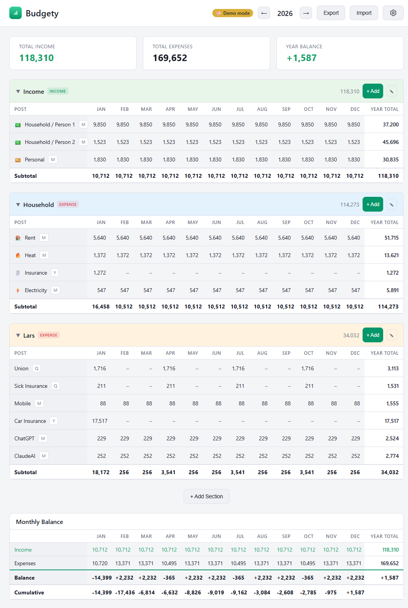

# Budgety

A self-hosted annual budget planner. Track income and expenses across custom sections with monthly breakdowns, running balances, and cumulative totals.



## Docker deployment

### Docker Hub

The image is published to Docker Hub as `larsmikki/budgety:latest`.

**docker-compose.yml:**

```yaml
version: "3"
services:
  budgety:
    image: larsmikki/budgety:latest
    container_name: budgety
    ports:
      - "3000:3000"
    volumes:
      - budgety-data:/app/data
    restart: unless-stopped
    healthcheck:
      test: ["CMD", "wget", "--spider", "-q", "http://localhost:3000/"]
      interval: 300s
      timeout: 5s
      retries: 3

volumes:
  budgety-data:
```

Data is persisted in the `budgety-data` volume at `/app/data/budget.json`.

### Build your own image

```bash
docker build -t budgety .
docker run -p 3000:3000 -v budgety-data:/app/data budgety
```

## Features

- **Annual budget grid** — 12-month view with per-post and per-section subtotals
- **Custom sections** — organize posts into income/expense groups with optional color coding
- **Flexible frequencies** — monthly, quarterly, biannual, yearly, or custom month selection
- **Inline editing** — double-click any cell to override amounts directly
- **Drag and drop** — reorder posts within sections
- **Quick Setup** — pre-built templates for common budget posts
- **Themes** — light/dark and color themes
- **Multi-currency** — USD, EUR, GBP, NOK, SEK, DKK, JPY, CHF, PLN with locale-aware formatting
- **Import/Export** — JSON backup and restore
- **Demo mode** — fictive amounts for screenshots without exposing real data

## Tech stack

- Single-file frontend (`index.html`) — vanilla HTML/CSS/JS, no build step
- Node.js HTTP server (`serve.js`) — static files + JSON REST API
- Zero dependencies
